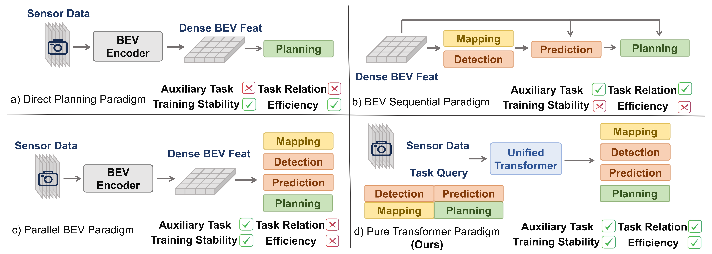

<div align="center">   

# DriveTransformer: Unified Transformer for Scalable End-to-End Autonomous Driving
</div>

Official implementation of paper [DriveTransformer: Unified Transformer for Scalable End-to-End Autonomous Driving](https://arxiv.org/abs/2503.07656). *Xiaosong Jia, Junqi You, Zhiyuan Zhang, Junchi Yan*. **ICLR 2025**



**DriveTransformer** offers a unified, parallel, and synergistic approach to end-to-end autonomous driving, facilitating easier training and scalability. The framework is composed of three unified operations: task self-attention, sensor cross-attention, temporal cross-attention and has three key features:
* **Task Parallelism:** All agent, map, and planning queries direct interact with each other at each block.
* **Sparse Representation:** Task queries direct interact with raw sensor features.
* **Streaming Processing:** Task queries are stored and passed as history information. 

**DriveTransformer** achieves state-of-the-art performance in both simulated closed-loop benchmark Bench2Drive and real world open-loop benchmark nuScenes with high FPS.

## Getting started

- [Download and installation](docs/INSTALL.md)
- [Data preprocessing](docs/DATA_PREP.md)
- [Training and Evaluation](docs/TRAIN_EVAL.md)

 
## Citation 

```bibtex
@inproceedings{jia2025drivetransformer,
  title={DriveTransformer: Unified Transformer for Scalable End-to-End Autonomous Driving},
  author={Xiaosong Jia and Junqi You and Zhiyuan Zhang and Junchi Yan},
  booktitle={International Conference on Learning Representations (ICLR)},
  year={2025}
}
```